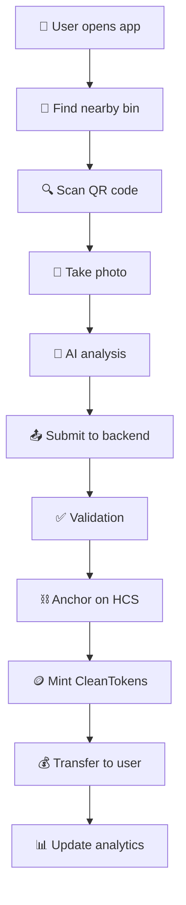

# 🗑️ BinSnap - Smart Waste Management System


## 🌟 Overview

**BinSnap** transforms smartphones into IoT sensors for smart waste management. Citizens earn **CleanTokens** by photographing waste bins, while AI analyzes fill levels and contamination. All data is anchored on **Hedera blockchain** for transparency and immutability.

### 🎯 Key Features

- 📸 **Photo-based monitoring** - No physical sensors required
- 🤖 **AI Analysis** - Fill level detection + contamination alerts  
- 🪙 **Token Rewards** - CleanTokens for validated submissions
- ⛓️ **Blockchain Anchoring** - Immutable data on Hedera HCS
- 📍 **GPS Verification** - Anti-fraud geolocation checks
- 🌐 **Decentralized** - No central database dependency
- 📊 **Real-time Analytics** - Admin dashboard with insights

---

## 🏗️ Architecture

```
📱 Mobile App          🌐 Backend API          ⛓️ Hedera Network
    ↓                       ↓                      ↓
📸 Photo Capture  →   🧠 AI Analysis    →   📝 HCS Consensus
📍 GPS Location   →   ✅ Validation     →   🪙 HTS Tokens  
🔍 QR Code Scan   →   📊 Statistics     →   🔍 Public Audit
```

### 📂 Project Structure

```
NeuroChainX/
├── 🔧 binsnap-backend/          # Express.js API + Hedera integration
├── 📱 user-frontend/            # React user mobile app
├── 👑 admin-dashboear-cibe-main/ # React admin dashboard
└── 📖 README.md                 # This file
```

---

## 🚀 Quick Start

### Prerequisites

- **Node.js** >= 18.0.0
- **npm** >= 8.0.0
- **Hedera Testnet Account** ([Get one here](https://portal.hedera.com))

### 1️⃣ Clone Repository

```bash
git clone <your-repo-url>
cd NeuroChainX
```

### 2️⃣ Setup Backend

```bash
cd binsnap-backend
npm install

# Configure environment
cp .env.example .env
# Edit .env with your Hedera credentials
```

### 3️⃣ Setup Frontend

```bash
cd ../user-frontend
npm install

cd ../admin-dashboear-cibe-main  
npm install
```

### 4️⃣ Start Development

```bash
# Terminal 1: Backend
cd binsnap-backend
npm run dev

# Terminal 2: User Frontend  
cd user-frontend
npm run dev

# Terminal 3: Admin Dashboard
cd admin-dashboear-cibe-main
npm run dev
```

---

## 🔧 Backend Configuration

### 📝 Environment Variables

Create `.env` in `binsnap-backend/`:

```env
# Hedera Network Configuration
HEDERA_NETWORK=testnet
ACCOUNT_ID=0.0.YOUR_ACCOUNT_ID
PRIVATE_KEY=YOUR_DER_ENCODED_PRIVATE_KEY

# Auto-configured after setup
HCS_TOPIC_ID=
HTS_TOKEN_ID=

# Server
PORT=3000
```

### 🏗️ Backend Architecture

```
src/
├── 📁 config/
│   └── hedera.js              # Hedera client configuration
├── 📁 services/
│   ├── hcsService.js          # Hedera Consensus Service
│   ├── htsService.js          # Hedera Token Service
│   ├── hederaReaderService.js # Blockchain data reader
│   └── storageService.js      # In-memory storage (dev)
├── 📁 routes/
│   ├── binsnap.js            # Core API endpoints
│   ├── admin.js              # Admin dashboard routes
│   ├── user.js               # User frontend routes
│   └── hederaRoutes.js       # Blockchain-based routes
└── app.js                    # Express app entry point
```

### 🛠️ Initial Setup

```bash
cd binsnap-backend

# 1. Create HCS Topic
curl -X POST http://localhost:3000/api/setup/create-topic

# 2. Create CleanToken  
curl -X POST http://localhost:3000/api/setup/create-token

# 3. Update .env with returned IDs
# HCS_TOPIC_ID=0.0.XXXXXX
# HTS_TOKEN_ID=0.0.XXXXXX

# 4. Restart server
npm run dev
```

---

## 📱 User Frontend

### 🎨 Tech Stack

- **React 18** + **TypeScript**
- **Vite** for fast development
- **Tailwind CSS** for styling
- **shadcn/ui** components
- **React Hook Form** for forms
- **React Query** for API calls

### 🧩 Key Components

```
src/
├── 📁 components/
│   ├── Navbar.tsx           # Navigation component
│   └── 📁 ui/               # shadcn/ui components
├── 📁 pages/                # Page components
├── 📁 hooks/                # Custom React hooks
└── 📁 lib/                  # Utilities & config
```

### 🔧 API Integration

```typescript
// Example: Submit bin photo
const submitBinData = async (data: BinSubmission) => {
  const response = await fetch('/api/submit-bin-data', {
    method: 'POST',
    headers: { 'Content-Type': 'application/json' },
    body: JSON.stringify(data)
  });
  return response.json();
};
```

---

## 👑 Admin Dashboard

### 📊 Features

- 📈 **Real-time Statistics** - Submissions, users, bins
- 🗑️ **Bin Management** - Status, fill levels, locations
- 👥 **User Analytics** - Rankings, activity, tokens
- 📋 **Transaction History** - All blockchain interactions
- 📊 **Advanced Analytics** - Charts, trends, insights

### 🎨 Tech Stack

- **React 18** + **TypeScript**
- **Recharts** for data visualization
- **Tailwind CSS** + **shadcn/ui**
- **React Router** for navigation

### 🧩 Key Components

```
src/
├── 📁 components/
│   ├── DashboardStats.tsx     # Overview statistics
│   ├── AnalyticsPage.tsx      # Charts and graphs
│   ├── WasteReportsTable.tsx  # Data tables
│   └── TeamsPage.tsx          # User management
├── 📁 pages/
│   ├── Index.tsx              # Dashboard home
│   └── NotFound.tsx           # 404 page
└── 📁 types/                  # TypeScript definitions
```

---

## 🌐 API Documentation

### 🔧 Core Endpoints

#### Submit Bin Data
```http
POST /api/submit-bin-data
Content-Type: application/json

{
  "binId": "BIN001",
  "fillLevel": 75,
  "contamination": false,
  "imageHash": "sha256abcdef...",
  "gps": {"lat": 48.8566, "lon": 2.3522},
  "userId": "user123",
  "userAccountId": "0.0.6153352"
}
```

#### Get System Status
```http
GET /api/status
```

### 📱 User Endpoints

#### User Profile
```http
GET /api/user/:userId/profile
```

#### Token Balance
```http
GET /api/user/:userId/tokens
```

#### Submission History
```http
GET /api/user/:userId/history
```

#### Nearby Bins
```http
GET /api/bins/nearby?lat=48.8566&lon=2.3522&radius=1000
```

### 👑 Admin Endpoints

#### Global Statistics
```http
GET /api/admin/stats
```

#### Bin Management
```http
GET /api/admin/bins
```

#### User Analytics
```http
GET /api/admin/users
```

#### Advanced Analytics
```http
GET /api/admin/analytics
```

### 🌐 Hedera-Based Endpoints

#### Blockchain Statistics
```http
GET /api/hedera/stats
```

#### User Profile from Blockchain
```http
GET /api/hedera/user/:userId/profile
```

#### Token Balance from HTS
```http
GET /api/hedera/user/:userId/tokens?accountId=0.0.XXXXXX
```

---

## ⛓️ Hedera Integration

### 🔗 Hedera Consensus Service (HCS)

**Purpose**: Immutable data anchoring

```javascript
// Data format anchored on HCS (max 200 bytes)
{
  "binId": "BIN001",
  "fillLevel": 75,
  "contamination": false,
  "imageHash": "sha256abc...",
  "gps": {"lat": 48.8566, "lon": 2.3522},
  "userId": "user123",
  "timestamp": "2025-06-14T01:37:22.996Z"
}
```

### 🪙 Hedera Token Service (HTS)

**CleanToken (CLEAN)**:
- **Type**: Fungible token
- **Reward**: 10 tokens per validated photo
- **Supply**: Infinite (minted on demand)
- **Decimals**: 0 (whole tokens only)

### 💰 Cost Analysis

| Operation | Cost (HBAR) | Cost (USD) |
|-----------|-------------|------------|
| HCS Message | ~0.0001 | ~$0.000006 |
| Token Mint | ~0.001 | ~$0.00006 |
| Token Transfer | ~0.001 | ~$0.00006 |
| **Total per photo** | **~0.0021** | **~$0.00013** |

---

## 🔍 Anti-Fraud System

### 🛡️ Verification Layers

1. **Dynamic QR Codes**
   - Updated weekly in each bin
   - Prevents photo reuse

2. **GPS Verification**
   - Distance check: < 15m from bin
   - Prevents remote submissions

3. **Image Hash Verification**
   - SHA-256 hash stored on-chain
   - Third-party audit capability

4. **EXIF Data Analysis**
   - Timestamp verification
   - Metadata consistency checks

### 🔒 Fraud Detection Flow

```
📸 Photo Taken → 🧠 AI Analysis → 📍 GPS Check → 🔍 QR Validation → ⛓️ Hash Storage
      ↓              ↓             ↓            ↓              ↓
   Real-time    Fill Level    Location OK   Code Valid   Immutable Proof
```

---

## 📊 Data Flow

### 🔄 Complete Workflow



### 🎯 Data Sources

#### Memory-Based (Fast, Volatile)
```http
/api/admin/*     # ~10ms response
/api/user/*      # Temp storage
/api/bins/*      # Lost on restart
```

#### Hedera-Based (Slower, Permanent)  
```http
/api/hedera/*    # ~1-3s response
                 # Immutable data
                 # Survives restarts
```

---

## 🧪 Testing

### 🔬 Unit Tests

```bash
cd binsnap-backend
npm test
```

### 🧑‍💻 API Testing

```bash
# Test core functionality
curl http://localhost:3000/api/status

# Test bin submission
curl -X POST http://localhost:3000/api/submit-bin-data \
  -H "Content-Type: application/json" \
  -d '{"binId":"TEST001","fillLevel":50,...}'

# Test Hedera integration
curl http://localhost:3000/api/hedera/stats
```

### 📱 Frontend Testing

```bash
cd user-frontend
npm run test

cd ../admin-dashboear-cibe-main
npm run test
```

---

## 🚀 Deployment

### 🔧 Backend (Production)

```bash
# Build for production
npm run build

# Environment variables
export HEDERA_NETWORK=mainnet
export ACCOUNT_ID=0.0.YOUR_MAINNET_ID
export PRIVATE_KEY=YOUR_MAINNET_KEY

# Start production server
npm start
```

### 📱 Frontend (Production)

```bash
# User Frontend
cd user-frontend
npm run build
# Deploy dist/ folder

# Admin Dashboard  
cd admin-dashboear-cibe-main
npm run build
# Deploy dist/ folder
```

### ☁️ Cloud Deployment Options

- **Heroku**: Easy Node.js deployment
- **Vercel**: Perfect for React frontends
- **AWS EC2**: Full control
- **Digital Ocean**: Cost-effective
- **Railway**: Modern deployment platform

---

## 🔧 Development

### 📝 Code Style

```bash
# Linting
npm run lint

# Formatting
npm run format

# Type checking (TypeScript)
npm run type-check
```

### 🐛 Debugging

#### Backend Debug
```bash
# Verbose logging
DEBUG=* npm run dev

# Check Hedera connection
curl http://localhost:3000/api/hedera/debug
```

#### Frontend Debug
```javascript
// Enable React DevTools
// Check browser console for API calls
// Use React Query DevTools
```

### 🔄 Hot Reload

- **Backend**: Nodemon auto-restarts on changes
- **Frontend**: Vite HMR for instant updates
- **CSS**: Tailwind JIT compilation

---

## 📈 Performance

### ⚡ Optimization Strategies

#### Backend
- **HCS Message Cache**: 30-second TTL
- **Gzip Compression**: Reduce payload size
- **Rate Limiting**: Prevent API abuse
- **Pagination**: Limit large data sets

#### Frontend
- **Code Splitting**: Lazy load routes
- **Image Optimization**: WebP format
- **Bundle Analysis**: Webpack analyzer
- **CDN**: Static asset delivery

### 📊 Benchmarks

| Endpoint | Memory Route | Hedera Route |
|----------|-------------|--------------|
| Stats | ~10ms | ~2000ms (1st), ~50ms (cached) |
| User Profile | ~5ms | ~1500ms (1st), ~30ms (cached) |
| Bin History | ~8ms | ~1800ms (1st), ~40ms (cached) |

---

## 🛡️ Security

### 🔒 Best Practices

#### API Security
- **CORS**: Configured origins
- **Rate Limiting**: Prevent DDoS
- **Input Validation**: Sanitize all inputs
- **HTTPS**: SSL/TLS encryption

#### Blockchain Security
- **Private Key**: Secure storage (env vars)
- **Account Permissions**: Minimal required access
- **Transaction Validation**: Double-check operations
- **Audit Trails**: Immutable logs

#### Frontend Security
- **XSS Protection**: Sanitized outputs
- **CSRF Protection**: Token validation
- **Content Security Policy**: CSP headers
- **Dependency Scanning**: Known vulnerabilities

---

## 🤝 Contributing

### 🔄 Development Workflow

1. **Fork** the repository
2. **Create** feature branch: `git checkout -b feature/amazing-feature`
3. **Commit** changes: `git commit -m 'Add amazing feature'`
4. **Push** to branch: `git push origin feature/amazing-feature`
5. **Open** Pull Request

### 📝 Code Standards

- **ESLint**: JavaScript/TypeScript linting
- **Prettier**: Code formatting
- **Conventional Commits**: Commit message format
- **TypeScript**: Strict type checking

### 🧪 Testing Requirements

- Unit tests for new features
- Integration tests for API endpoints
- E2E tests for critical user flows
- Performance tests for optimization

---

## 📋 Roadmap

### 🎯 Phase 1 (Current)
- ✅ Core API with Hedera integration
- ✅ Basic user frontend
- ✅ Admin dashboard
- ✅ Anti-fraud system

### 🚀 Phase 2 (Q2 2025)
- 📱 Mobile app (React Native)
- 🤖 Advanced AI models
- 🌍 Multi-language support
- 📊 Enhanced analytics

### 🌟 Phase 3 (Q3 2025)
- 🏙️ Smart city integration
- 🔄 IoT sensor compatibility
- 💱 Token marketplace
- 🌐 Mainnet deployment

### 🎯 Phase 4 (Q4 2025)
- 🤖 Predictive analytics
- 🏆 Gamification features
- 🔗 Integration APIs
- 📈 Business intelligence

---

## 🆘 Support

### 📖 Documentation
- **API Docs**: `/api` endpoint documentation
- **Component Docs**: Storybook (coming soon)
- **Video Tutorials**: YouTube channel (coming soon)

### 🐛 Issue Reporting
- **GitHub Issues**: Bug reports and feature requests
- **Discord**: Community support
- **Email**: Direct support contact

### 🔧 Troubleshooting

#### Common Issues

**Backend won't start**
```bash
# Check Node.js version
node --version  # Should be >= 18

# Verify environment variables
cat .env

# Check Hedera credentials
curl http://localhost:3000/api/status
```

**Frontend build fails**
```bash
# Clear node_modules
rm -rf node_modules package-lock.json
npm install

# Check TypeScript errors
npm run type-check
```

**Hedera connection issues**
```bash
# Verify account balance
# Check network (testnet vs mainnet)
# Validate private key format
```

---

## 📄 License

This project is licensed under the **MIT License** - see the [LICENSE](LICENSE) file for details.

---

## 🙏 Acknowledgments

- **Hedera Network** for blockchain infrastructure
- **OpenAI** for AI integration possibilities
- **React Community** for amazing tooling
- **shadcn/ui** for beautiful components
- **Tailwind CSS** for utility-first styling

---

## 📞 Contact

- **Project Lead**: [Your Name]
- **Email**: your.email@example.com
- **LinkedIn**: [Your LinkedIn]
- **GitHub**: [Your GitHub]
- **Website**: [Project Website]

---

<div align="center">

**🌱 Built with ❤️ for a cleaner world 🌍**

[](https://hedera.com)
[](https://reactjs.org)
[](https://typescriptlang.org)
[](https://nodejs.org)
[](https://expressjs.com)

**[⭐ Star this project](https://github.com/your-repo) • [🐛 Report Bug](https://github.com/your-repo/issues) • [💡 Request Feature](https://github.com/your-repo/issues)**

</div>
